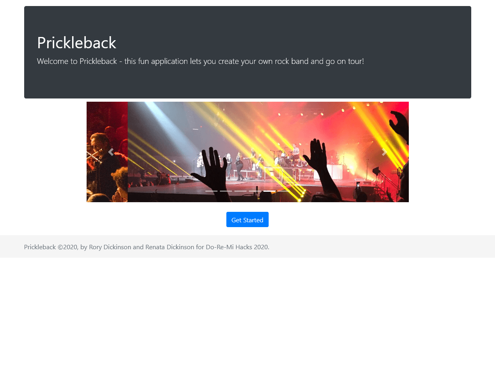
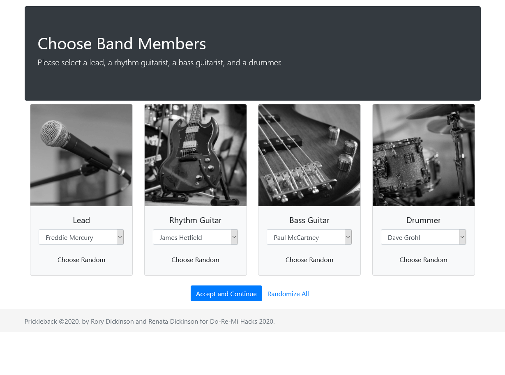
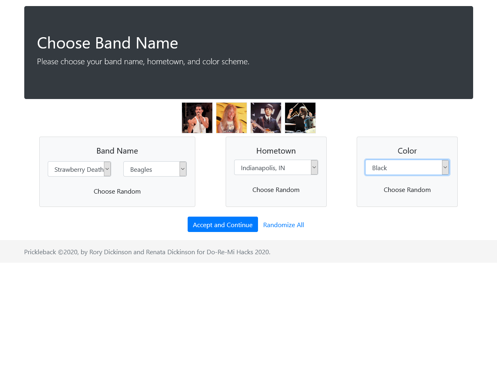
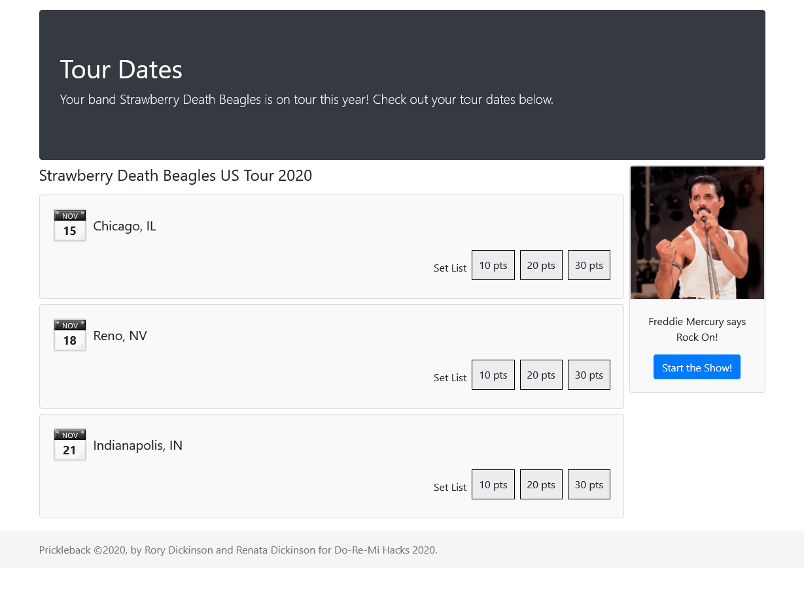
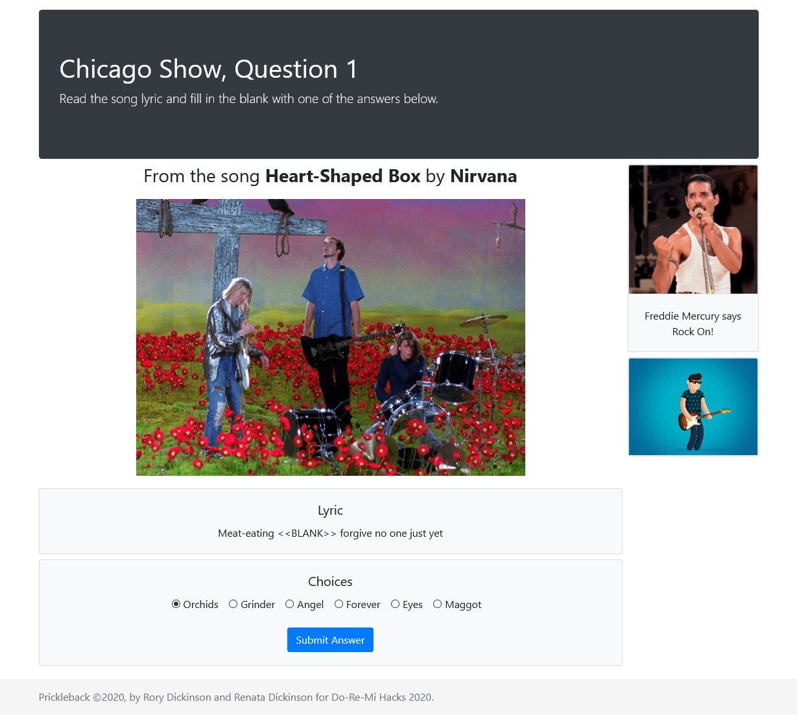
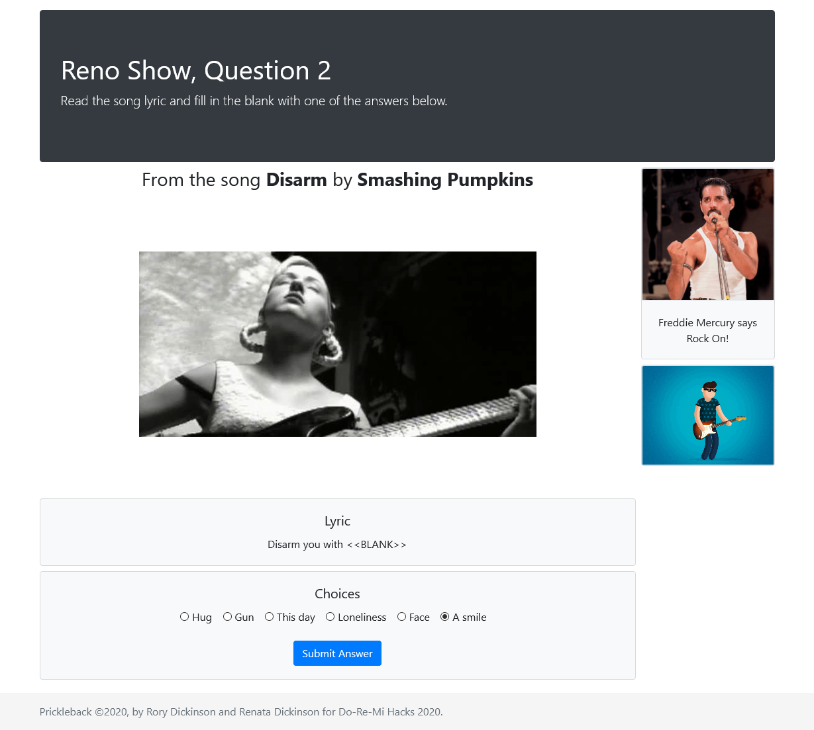
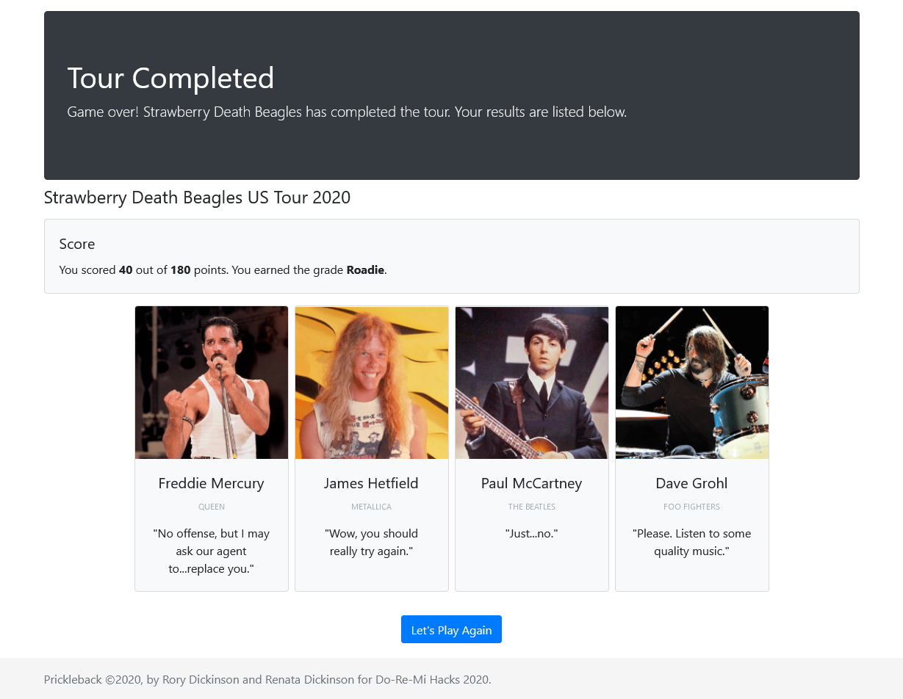

# Prickleback

## Summary

Game implemented as a web application in which you create a fantasy rock band lineup, go on tour, and answer questions to earn points. Submission for MLH Do-Re-Mi Hacks in November 2020.

## Technologies Used

### Front-End

### Back-End

### Development Tools

## Attribution

Photos harvested from [pexels.com](https://www.pexels.com) and [unsplash.com](https://unsplash.com) (can modify and use for free), WEBP files converted to JPG at [ezgif.com](https://ezgif.com/), edited at [pixlr.com](https://pixlr.com/x/), and then compressed at [tinypng.com](https://tinypng.com/).

## Screenshots

